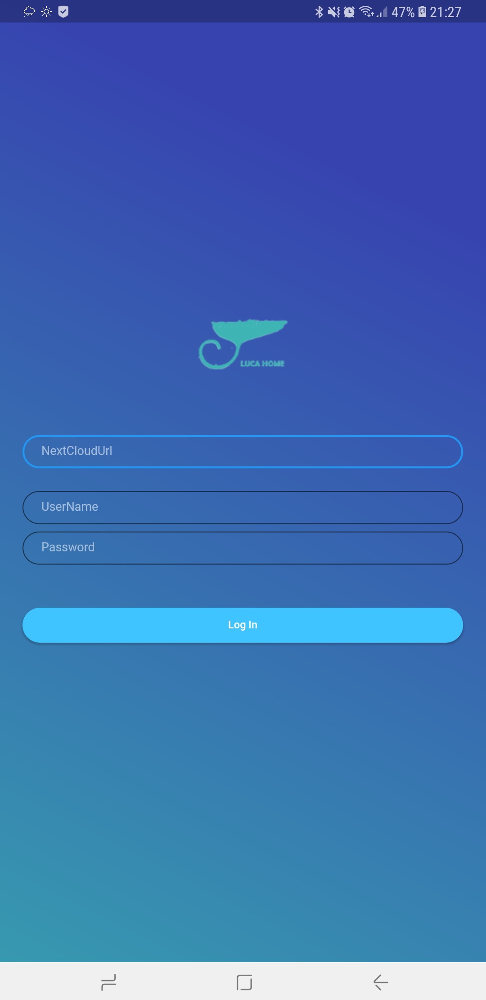
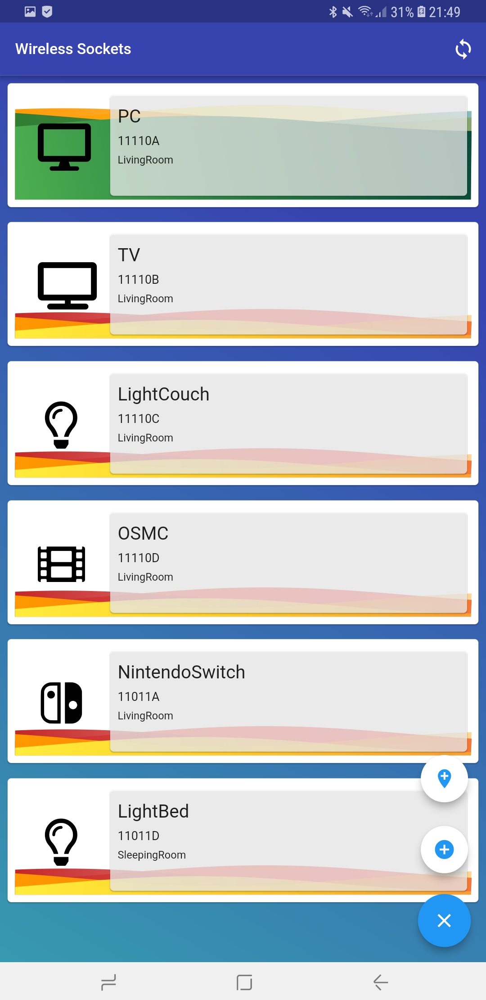
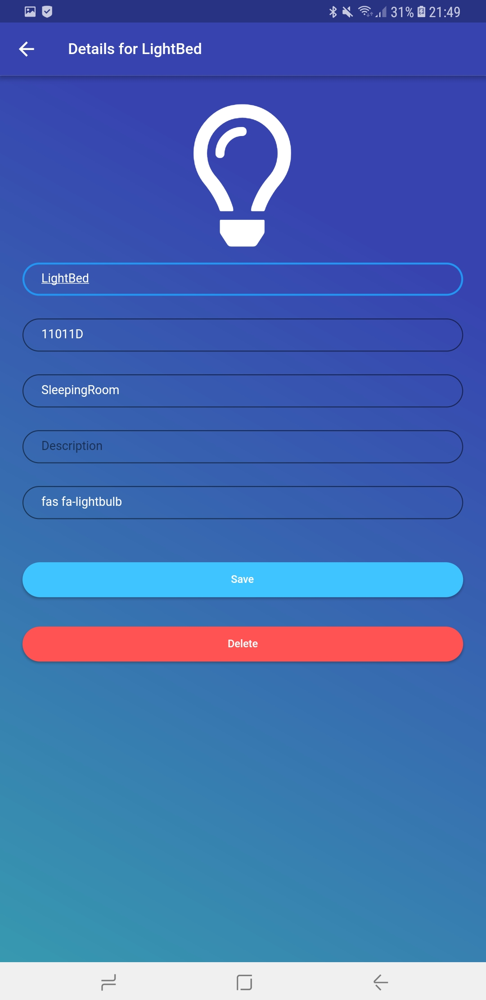

# LucaHome-AndroidApplication

Android Frontend to control sockets hosted by a NextCloud server.

## Getting Started

This project is a starting point for a Flutter application.

A few resources to get you started if this is your first Flutter project:

- [Lab: Write your first Flutter app](https://flutter.io/docs/get-started/codelab)
- [Cookbook: Useful Flutter samples](https://flutter.io/docs/cookbook)

For help getting started with Flutter, view our 
[online documentation](https://flutter.io/docs), which offers tutorials, 
samples, guidance on mobile development, and a full API reference.

## Mobile

Android client to remotely control wireless sockets and switches using nextcloud server.

## Screenshots

	
	
	
	
	

## License

LucaHome-AndroidApplication is distributed under the MIT license. [See LICENSE](LICENSE.md) for details.